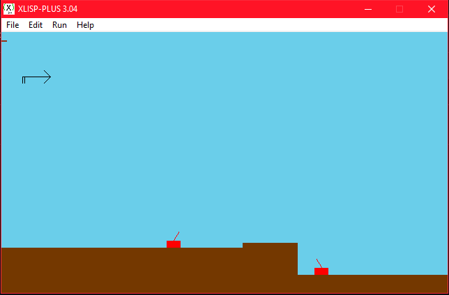
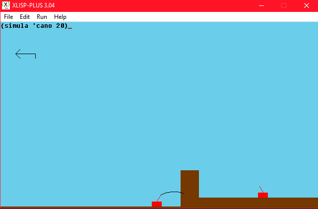
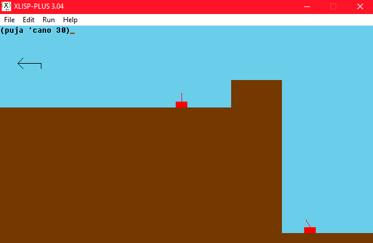

# Tank Wars Game
The classic tank wars game programmed in Common Lisp

Important: The comments and the name of all functions are written in Catalan, however i will do my best to translate it to you into English.
If you have any trouble with the execution do not hesitate to contact me

For further information take a look at the documentation file

# Instructions:

1. In order to execute the code you need to install XLisp (i'm currently using the version 3.04)

2. Download the file "canons.lsp" and place it to your XLisp folder.

3. To load the file type: ``(load 'canons)``

## How to play the game:


Each player controls one cannon

First player is called ``cano`` (cano means cannon in catalan)

Second player is called ``cano2``

The whole game can be played with these 4 functions

1.
```
(pinta)
```
This function initializes the scenery, paints all the elements and place the writing cursor at the top left of the screen where players will enter the instructions.
The default inclination of both cannons is set to 60º.
This function has to be executed at the beginning of the game and only need to be run once.
Once executed, the game should look something like this:



As you can see there are the 2 tanks, the mountains and the arrow at the top left indicates the wind speed and direction

2.
```
(simula 'cannonname speed)
```

This function given a cannon name (either cano or cano2) and the speed of the shot, calculates and draws the trajectory of the projectile.



In this example, the first cannon shoots a projectile with a speed of 20.

3.
```
(puja 'cannonname degrees)
```
"puja" means "rise/increase" in catalan.
This function increases the angle of the cannon.



Since the initial angle is 60º, if we increase the angle by 30 we got the cannon looking at 90º

4.
```
(baixa 'cannonname degrees)
```
This function does the same as the 3rd function but the other way around
